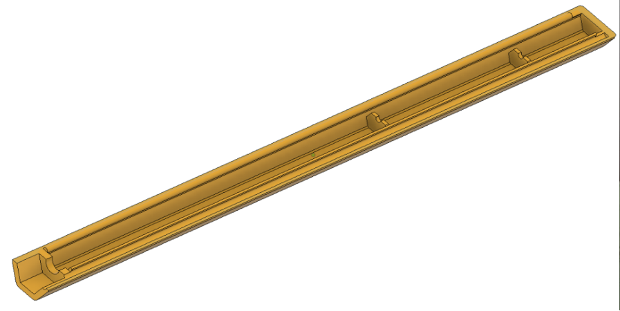
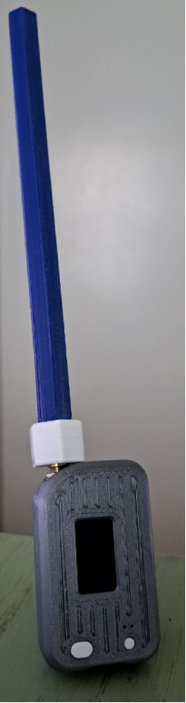

# Meshcore Coaxial Sleeve Dipole (910.525 MHz): Assembly & Technical Specification

**By Rich Gordon, W6BOT**

*Originally submitted as an 11-page technical specification dated May 3, 2026,
© 2026, all rights reserved. Transcribed here preserving the author's wording;
figures reproduced from the author's NanoVNA measurements and photos.*

This document defines the as-built mechanical and electrical parameters for the
high-stability coaxial sleeve dipole optimized for Meshcore nodes. The assembly
utilizes a 7/32" brass sleeve and RG-174 coaxial cable to achieve a precise
resonant match at the target frequency.

Note: AI was utilized to identify and verify dimensions, and velocity factor, for
this design.

## Antenna description

### Theoretical basis

A sleeve dipole is a variation of the fundamental half-wave dipole. While a
theoretical isotropic radiator has a gain of 0 dBi, the half-wave dipole
concentrates energy perpendicular to the axis of the radiator, resulting in a
gain of 2.15 dBi (some loss is expected due to velocity factor and loss tangent
of the enclosure).

### Factors affecting gain in this build

**Common mode suppression:** The 360° solder bond at the 65.5 mm mark ensures the
sleeve acts as a high-impedance balun. This prevents RF current from traveling
down the outside of the feedline, which would otherwise distort the radiation
pattern and reduce effective gain.

**Enclosure impact:** The 12 mm PETG hex enclosure introduces slight dielectric
losses. While PETG is relatively RF-transparent at 910.525 MHz, the proximity of
the material (dielectric loading) may slightly compress the radiation pattern,
potentially shifting the gain by +/-0.2–0.5 dB depending on the exact material
purity and wall thickness.

**Concentricity:** Using the RG-58U jacket segment as a spacer ensures the
radiator remains centered within the brass sleeve. Maintaining a constant
characteristic impedance of 50 ohms minimizes return loss, ensuring maximum
power transfer to the radiating elements.

### Radiation pattern

The expected radiation pattern is toroidal (donut-shaped).

- **Maximum gain:** Perpendicular to the 150.5 mm vertical assembly (toward the
  horizon).
- **Null points:** Directly above the tip termination and directly below the SMA
  connector.

## Build parameters

- **Target frequency:** 910.525 MHz.
- **Transmission line:** RG-174 coaxial cable.
- **Sleeve material:** 7/32" x 0.014" wall brass tubing.
- **Environment:** 12 mm PETG hexagonal enclosure.
- **Centering mechanism:** 2–3 mm segment of RG-58U jacket (or similar) trimmed
  for concentric fit.

| Item | Component | Specification | Quantity |
|---|---|---|---|
| 1 | Coaxial Cable | RG-174 (12"/30 cm SMA jumper works well) | 1 |
| 2 | Sleeve Material | 7/32" x 0.014" wall brass tubing — K&S Precision Metals Round Brass Tube 8130 (7/32" OD x 0.014" wall x 12" long) | 60.0 mm |
| 3 | Connector | SMA crimp connector (not required if using an SMA jumper) | 1 |
| 4 | Centering Spacer | RG-58U jacket segment | 2 pcs, 2–3 mm |
| 5 | Enclosure | PETG 3D printed (polyethylene terephthalate glycol) | 1 set (2 halves) |
| 6 | Sealant | Neutral-cure silicone (e.g., Supreme Silicone M90006A) | As required |

## Dimension tables

All dimensions are measured starting from the 0.0 mm reference point at the top
of the SMA crimp ferrule.

### Individual component dimensions (as tuned)

| Component | Dimension (L) | Description |
|---|---|---|
| Standoff Gap | 5.5 mm | Distance between SMA crimp and sleeve base. |
| Sleeve Length | 60.0 mm | Physical length of the 7/32" brass tube. |
| Feedpoint Gap | 5.0 mm | Exposed center dielectric between sleeve and whip. |
| Radiator Whip | 80.0 mm | Length of center conductor from top of dielectric. |

### Cumulative (ordinate) dimensions

| Measurement Point | Ordinate (Z) | Feature Description |
|---|---|---|
| Reference 0 | 0.0 mm | Top of SMA crimp ferrule. |
| Point A | 5.5 mm | Bottom edge of brass sleeve. |
| Point B | 65.5 mm | Top edge of brass sleeve (360° solder point). |
| Point C | 70.5 mm | Top of exposed center dielectric. |
| Point D | 150.5 mm | Tip of radiating whip. |

*The assembled sleeve dipole, showing the 5.5 mm standoff, the 60 mm brass tube,
the critical 360° solder bond, the radiator, and the tip termination. Photo by
Rich Gordon, W6BOT.*

## Enclosure specification: 12 mm PETG hex

The antenna is housed in a custom 12 mm hexagonal PETG enclosure, providing
structural protection and environmental sealing.

- **Geometry:** The hexagonal profile increases mechanical rigidity and ensures
  stable positioning within the node chassis.
- **Dielectric loading:** The PETG material introduces parasitic capacitance,
  requiring the specific tuned lengths of 60.0 mm and 80.0 mm to maintain the
  910.525 MHz resonance.
- **Mechanical centering:** A 2–3 mm segment of RG-58U jacket is used as an
  internal spacer. This provides a precise friction fit between the RG-174 cable
  and the 4.85 mm ID of the 7/32" brass tube, ensuring strictly concentric
  geometry.

### Critical assembly requirements

- **360° solder bond:** The RG-174 shield must be fully bonded to the
  circumference of the brass sleeve at the 65.5 mm mark to establish the RF
  return path. Use care to not melt the center dielectric.
- **Concentricity (zero-heuristic rule):** The RG-58U jacket spacer must be
  positioned to prevent the radiator from deviating from the center axis,
  maintaining impedance stability.
- **Dimensional sanity check:** Total dimension = 5.5 (standoff) + 60.0 (sleeve) +
  5.0 (dielectric) + 80.0 (whip) = 150.5 mm.

### Mechanical specification: 12 mm PETG hexagonal enclosure

The radome for the 910.525 MHz coaxial sleeve dipole is a custom-engineered
hexagonal housing. It serves as both a structural chassis and a dielectric
component of the antenna system.

**Material requirements**

- **Polymer:** PETG (polyethylene terephthalate glycol-modified).
- 3 horizontal and 3 vertical perimeters.
- **Infill:** 100% (solid wall). Air gaps within the enclosure wall will cause
  inconsistent dielectric loading and shift the resonant frequency.
- **Wall thickness:** Optimized for the calibrated velocity factor (Vf) of the
  60.0 mm sleeve and 80.0 mm radiator.

**Geometric specifications**

The enclosure (radome) consists of two identical halves, which snap together.

- **Profile:** Hexagonal (6-sided).
- **Width (flat-to-flat):** 12.0 mm.
- **Internal channel:** 5.80 mm to 6.00 mm diameter. This provides a clearance
  fit for the 7/32" (5.56 mm) brass sleeve.
- **Internal alignment:** The channel must be perfectly centered to maintain the
  Item #3 (concentric geometry) requirement. Off-center placement will result in
  an asymmetrical radiation pattern.

**Dielectric considerations**

- **Dielectric constant:** approximately 2.4–3.0.
- **Velocity factor shift:** The proximity of the PETG walls effectively
  "shortens" the wavelength. The build dimensions of 150.5 mm (total extension)
  are specifically tuned to compensate for this shift.
- **RF transparency:** PETG is selected for its low loss tangent at sub-GHz
  frequencies, ensuring minimal signal attenuation for Meshcore nodes.

*3D model of the two-piece hexagonal PETG enclosure. Image by Rich Gordon,
W6BOT.*

### Integration and sealing

- **SMA interface:** The base of the enclosure must securely capture the SMA
  connector body to prevent rotational stress on the 5.5 mm standoff gap.
- Should this antenna be intended for outdoor use, a moisture barrier is
  advisable. Once the antenna is tuned and verified, the entry and exit points of
  the enclosure should be sealed with a neutral-cure silicone (e.g., Supreme
  Silicone M90006A) to prevent internal oxidation of the brass sleeve and copper
  radiator.
- **Mounting:** The hexagonal flat faces allow for secure zip-tie or bracket
  mounting to node enclosures without the slippage common to circular radomes.
- To complete the enclosure for final assembly and make a robust connection at
  this high-stress point, a hex bushing designed to tightly fit over the SMA end
  of the enclosure. Use a heat gun or other appropriate source to warm the
  bushing to soften the material prior to forcing the enclosure into the bushing.
  Alternately, tape, wire tie or similar may be used.

### Final assembly verification

The antenna must be fully inserted into the enclosure before final VNA
verification.

- **Sanity check:** Ensure the 80.0 mm radiator is not bent or compressed against
  the end-cap of the enclosure, as this will introduce significant inductive
  loading.

*The finished antenna mounted on a Meshcore node. Photo by Rich Gordon, W6BOT.*

## Tuning and calibration protocol

The following procedures define the deterministic tuning steps for verifying the
resonance of the as-built antenna within the 12 mm PETG hex enclosure.

### Pre-assembly resonance check

Before final sealing in the PETG housing, perform an initial VNA (Vector Network
Analyzer) sweep to establish a baseline.

- **Target center frequency:** 910.525 MHz.
- **Measurement reference:** Connect the SMA interface directly to a calibrated
  VNA.
- **Initial SWR target:** < 1.5:1 in free air. Note that the frequency will shift
  downward once inserted into the PETG housing due to dielectric loading.

### Physical tuning adjustments

If the resonant frequency deviates from 910.525 MHz, adjust the 80.0 mm radiator
whip (Point C to Point D).

- **Frequency too low:** Trim the radiator tip in 0.5 mm increments. Apply a
  minimal amount of solder to the tip after each cut to prevent the RG-174
  strands from unraveling.
- **Frequency too high:** Verify the 360° solder bond at the top of the sleeve
  (Point B). A cold joint or incomplete bond at the 65.5 mm mark will cause
  erratic resonance shifts.
- **Impedance matching:** Ensure the RG-58U jacket spacer is maintaining
  concentricity between the RG-174 and the 7/32" brass tube. Non-concentric
  geometry shifts the characteristic impedance away from 50 ohms.

As you can see by the graphs, while the 2:1 bandwidth is fairly wide, there is a
significant advantage in tuning to your desired frequency. Note however that the
wavelength at this frequency is approximately 330 mm / 12.96". When tuning, it is
critical that you make your trim based on readings with the enclosure installed.

| Threshold | Low Frequency (fL) | High Frequency (fH) | Total Bandwidth (Δf) |
|---|---|---|---|
| 2.0:1 | ~ 887.0 MHz | > 935.0 MHz | > 48.0 MHz |
| 1.5:1 | ~ 898.5 MHz | ~ 922.5 MHz | 24.0 MHz |

### Enclosure calibration

The 12 mm PETG hex enclosure acts as a radome and alters the electrical length of
the antenna.

- **Dielectric offset:** Final tuning must be performed with the antenna fully
  seated in the enclosure.
- **Final verification:** The as-built total extension of 150.5 mm (from SMA crimp
  to radiator tip) is specifically calibrated for the velocity factor shift
  introduced by this housing.

### Summary of tapping/ordinate points for VNA reference (910.525 MHz)

| Measurement Goal | Component to Inspect | Ordinate (Z) Target |
|---|---|---|
| Coarse Tuning | Radiator Whip Length | 80.0 mm |
| Return Loss/SWR | 360° Solder Joint | 65.5 mm |
| Stability/Noise | Standoff Gap | 5.5 mm |
| Resonance Center | Total Extension | 150.5 mm |

### Alternate Meshcore frequencies utilized in the US

| Frequency (MHz) | Standoff Gap | Sleeve Length | Feedpoint Gap | Radiator Whip | Total Length |
|---|---|---|---|---|---|
| 909.875 (Sacramento) | 5.50 | 60.04 | 5.00 | 80.06 | 150.60 |
| 910.525 (Reference) | 5.50 | 60.00 | 5.00 | 80.00 | 150.50 |
| 915.000 (High Speed) | 5.47 | 59.71 | 4.98 | 79.61 | 149.77 |
| 927.875 (SoCal) | 5.40 | 58.88 | 4.91 | 78.50 | 147.69 |

As you can see from the table, the minor adjustments for these frequencies are
beyond what would be practical for "cut to length," and due to variations in
materials each antenna needs to be fine tuned with a VNA for the actual
frequency.

Dimensions for other frequencies may be calculated by: L_NEW = L_REF × (f_REF /
f_NEW).

## Other notes and comments

My decision to build this antenna stems from the poor performance of the 40 mm
stub antennas which come packaged with the Meshcore "Starter" kits, and the fake
claims of high gain whips typically available from Amazon and AliExpress.

Keep in mind that a 1/2 wave dipole has a gain of 2.15 dBi (gain over an isotropic
radiator) due to the radiation being shaped into a "donut."

| Antenna Type | Typical Marketed Gain | Actual Realized Gain | Inflation Delta (Δ) | Technical Cause of Delta |
|---|---|---|---|---|
| 40 mm Kit Stub | 2.5 dBi | -1.5 dBi | 4.0 dB | High ohmic loss in loading coil; aperture too small. |
| 82 mm 1/4λ Whip | 3.0 dBi | 0.5 – 1.0 dBi | 2.0 dB | Missing ground plane / counterpoise in field use. |
| 1/2λ Sleeve Dipole (this build) | 1.9 dBi | 1.9 dBi | 0.0 dB | Verified via NanoVNA; ground-independent. |
| 190 mm Whip | 10 dBi | 1.5 – 2.5 dBi | 4.85 – 7.85 dB | Mathematically impossible. |
| 18" Collinear | 8.0 – 10.0 dBi | 5.5 – 6.5 dBi | 2.5 – 3.5 dB | Phasing coil losses; pattern "lobing" (energy tilt). |
| 600 mm Yagi | 18.0 dBi | 9.0 – 11.0 dBi | 7.0 – 9.0 dB | Physical size restricts element count (aperture limit). |

### The "cable loss" oversight

A common fallacy across all antenna types is ignoring the feed line. RG-58 or
RG-174 coax has high attenuation at 910 MHz.

- **RG-174 loss:** Approximately 1.0 dB per meter (0.3 dB/ft).
- **The result:** If you use a "high-gain" 6 dBi antenna but connect it with 3.0
  meters (9.8 ft) of RG-174, you have lost 3.0 dB in the cable. Your net system
  gain is now 3.0 dBi, roughly the same as mounting this sleeve dipole directly to
  the node with no cable.

If you would like to build this antenna I can provide the STL files for the
enclosure. Please send any comments, questions or requests for the enclosure STL
files to wsixbot@gmail.com.

73,
Rich Gordon, W6BOT

## Measurement plots (NanoVNA)

The author included the following NanoVNA measurements. All are in `assets/` and
can be included as space allows.

*Measured VSWR sweep. The SWR minimum sits near the target frequency with a wide
2:1 bandwidth. NanoVNA plot by Rich Gordon, W6BOT.*

Additional plots available in `assets/`: S11 log-magnitude
(`feature-sleeve-dipole-s11-logmag-w6bot.png`), Smith chart
(`feature-sleeve-dipole-smith-w6bot.png`), impedance
(`feature-sleeve-dipole-impedance-w6bot.png`), phase
(`feature-sleeve-dipole-phase-w6bot.png`), and quality factor
(`feature-sleeve-dipole-qfactor-w6bot.png`).

## Editor Notes

Transcribed from Rich's 11-page PDF, preserving his wording and structure. Light
mechanical fixes only: "bandwith" → "bandwidth," "approprite" → "appropriate,"
"tighly" → "tightly," "wiretie" → "wire tie," "AliExpress" capitalization, and one
clause smoothed ("radiation be move to a donut" → "radiation being shaped into a
donut"). All dimensions, tables, and figures reproduced as given.

To decide / verify before publication:

- **Length and fit.** This is a full 11-page technical spec — long and dense for
  the newsletter. Consider running a condensed feature (motivation, the build
  table, one or two photos, the VSWR result) with an offer of the full spec and
  STL files by email. Happy to produce that shorter version on request.
- **Reprint permission.** The document is marked "© 2026, all rights reserved."
  Rich invites requests for STL files and comments, which implies willingness, but
  confirm his permission to publish and how much he wants reproduced.
- **Callsign.** W6BOT — verify (not in the club roster; his email wsixbot@gmail.com
  reads as "W6BOT"). Confirm correct spelling of "Rich Gordon."
- **Technical claims are the author's analysis.** The gain-comparison table
  (marketed vs. realized gain, "Mathematically impossible," etc.) is Rich's
  opinion and measurement, not independently verified. It also criticizes products
  from named vendors (Amazon, AliExpress). Suggest attributing clearly to Rich and
  softening the vendor language to fit the club's friendly voice, or presenting it
  as "the author's testing."
- **AI-assisted design.** The author notes AI was used to derive dimensions and
  velocity factor; the article itself stresses verifying every build with a VNA.
  Fine to keep as-is; just flagging.
- **Band context.** 910.525 MHz and the alternate frequencies sit in the 902–928
  MHz band (shared ISM / 33 cm amateur). No regulatory claims to correct; consider
  a one-line note on band use for newer readers.
- **Images.** Nine figures extracted to `assets/` (photos, CAD render, and five
  NanoVNA plots), all credited to Rich, W6BOT. Recommend the assembly photo, the
  node photo, and the VSWR plot for print; the rest are optional.
- **Abbreviations.** Spell out on first use if kept: VNA (Vector Network Analyzer,
  already expanded), SWR/VSWR, PETG, SMA, ID.
