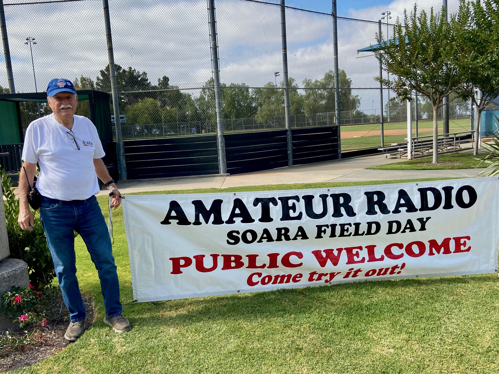
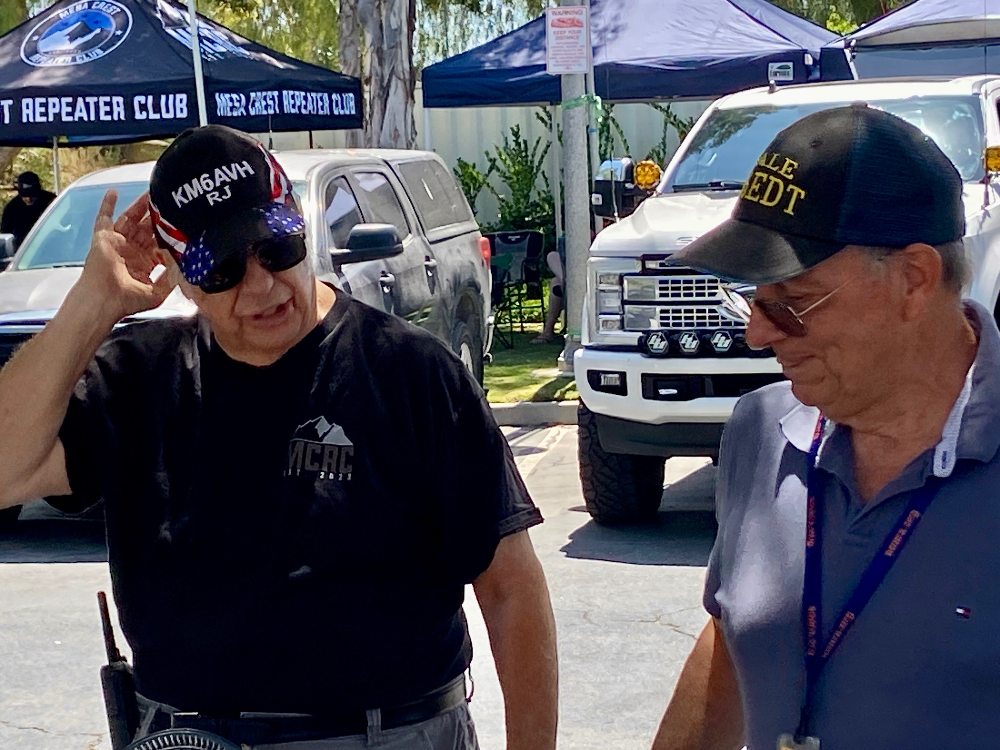
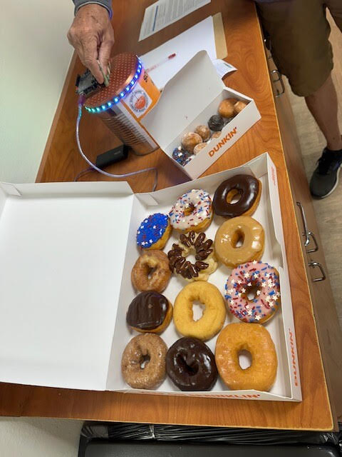
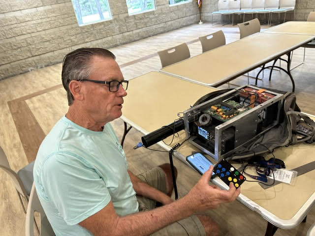
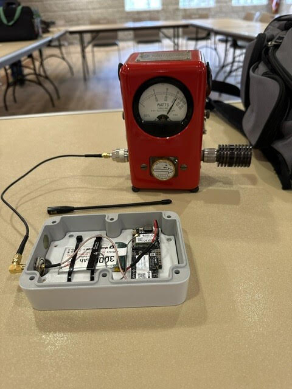
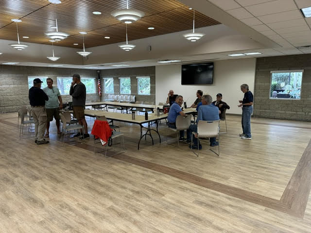

# The Propagator

**South Orange Amateur Radio Association | July 2026**

## Upcoming SOARA Events

### This Month — July 2026

| Date | Time | Event | Location |
|---|---|---|---|
| Saturday, July 18 | 9:00 AM | SOARA Elmer Saturday | Gilleran Park |
| Monday, July 20 | 6:00 PM | Ham Radio License Exams | Murray Center |
| Monday, July 20 | 6:30 PM | Membership Meeting | Murray Center |
| Monday, July 27 | 7:00 PM | Board Meeting | Murray Center |

### Next Month — August 2026

| Date | Time | Event | Location |
|---|---|---|---|
| Saturday, August 15 | 9:00 AM | SOARA Elmer Saturday | Gilleran Park |
| Monday, August 17 | 6:00 PM | Ham Radio License Exams | Murray Center |
| Monday, August 17 | 6:30 PM | Membership Meeting | Murray Center |
| Saturday, August 22 | 11:00 AM | SOARA Summer Picnic | Laguna Niguel Regional Park |
| Monday, August 24 | 7:00 PM | Board Meeting | Murray Center |

*Dates, locations, and times are subject to change. Check the
[SOARA website](https://www.soara.org) before attending.*

## President's Message

SOARA held our Field Day operations as planned on June 26-28. On Friday, starting
around 3 p.m., we unpacked, put up tents, erected antennas, ran coax and tested
radios, filters and a triplexer. 15 members helped with setup. We finished up
Saturday morning and started the propane powered generator just before 11 a.m. so
that we could run the radios on "alternate power," which allowed us to use our
usual 3A designation. This allows three active HF radios, a separate VHF/UHF radio
and a GOTA (Get On The Air) station. Operations started at about 11:10 a.m. and
continued to 11:00 a.m. Sunday morning. We had 34 SOARA members attend on Saturday
and 19 on Sunday. Tear down started around 11 a.m. and we were all done before 2
p.m.

*SOARA members gather at the club's 2026 Field Day site.*

We had a tent and display from MVRACES and were also joined by the Mesa Crest
Repeater Club. They brought several tents, a grill with great grilled hot dogs
(with bacon!) which were very tasty and much appreciated. They even cooked a few
extra for Saturday night dinner for SOARA. The energy and excitement that Mesa
Crest brought to SOARA's Field Day event was great. They expressed their thanks for
our invitation and they hope to join us next year.

There were 32 visitors signed in on Saturday. Our GOTA station was busy doing demos
and Ed Barnes, WA6ED, ran the education table with a number of exhibits for demos.
I found them interesting and there were a lot of discussions about what was being
shown.

We put up a new 80M/40M setup on the ball field, using a 35 foot heavy duty mast
holding up nearly flat inverted "V" antennas guyed to opposite fences on the
baseball field. We used two lengths of coax to feed the antennas through some common
mode chokes at the antenna feed point. This new antenna setup worked pretty well by
all reports. It took less than an hour to erect and take down and did not depend on
using the baseball field lighting poles as elevated guy points, which has been a
problem in recent years.

*RJ and Dale at the Field Day antenna site.*

I want to thank everyone who attended Field Day, especially those who helped setup
and tear down the operation. We had quite a number of operators of the various
stations helping SOARA get points for our submission to ARRL, but also, hopefully
enjoying using much better antenna setups than they might have at home.

I would also like to take this opportunity to encourage all SOARA members that did
not attend to consider attending in future years. Field Day is an interesting and
rewarding event that is worth attending.

Finally, as part of the operation planning, I would like to hear suggestions for
improvements or things you noticed while attending that we should change for next
year. Send any ideas to w6edt@soara.org.

Our Annual Picnic is coming up on August 22 at the Laguna Niguel Regional Park from
11 a.m. until about 3 p.m. I hope to see you there!

73,

Dale Tyler, W6EDT
SOARA President

## SOARA Field Day 2026 — By the Numbers

*Compiled from the K6SOA Field Day 2026 contact log. All times Pacific Daylight
Time (PDT, UTC−7).*

Another Field Day is in the books for the South Orange Amateur Radio Association,
and K6SOA delivered a solid 24-hour performance across 10 bands and three operating
modes. From the first contact at 11:00 AM PDT Saturday to the final QSO just after
10:00 AM Sunday, operators kept the chairs warm, the rigs hot, and the log growing.

When the dust settled, K6SOA had logged **660 QSOs** with **597 unique stations**
spanning **75 ARRL sections** plus DX — reaching all corners of the country and
landing contacts on four continents.

### QSO Totals by Band and Mode

| Band | Phone | CW | Digital | Total |
|--------|------:|---:|--------:|----------:|
| 160m | 0 | 0 | 1 | 1 |
| 80m | 7 | 7 | 21 | 35 |
| 40m | 131 | 11 | 16 | 158 |
| 20m | 227 | 70 | 28 | 325 |
| 15m | 84 | 16 | 3 | 103 |
| 10m | 11 | 0 | 0 | 11 |
| 6m | 7 | 0 | 0 | 7 |
| 2m | 12 | 0 | 0 | 12 |
| 1.25m | 5 | 0 | 0 | 5 |
| 70cm | 3 | 0 | 0 | 3 |
| **Total** | **487** | **104** | **69** | **660** |

20 meters was the workhorse of the event, accounting for nearly half of all
contacts (325 QSOs, 49%). The 40 meter band was a close second with 158 QSOs,
particularly productive after dark. 15 meters surprised with a strong showing of
103 contacts, a welcome sign of improving solar conditions. The VHF/UHF contingent
made their mark too, with contacts on 2m, 1.25m, and 70cm adding some local flavor
to the log.

### Score Summary

| Category | Value |
|----------|------:|
| Phone QSOs (487 × 1 pt) | 487 |
| CW QSOs (104 × 2 pts) | 208 |
| Digital QSOs (69 × 2 pts) | 138 |
| **QSO Points** | **833** |

*Note: Final official score will include applicable bonus points (e.g., emergency
power, public information, satellite, etc.).*

### Sections Worked — 75 Domestic + DX

K6SOA worked **75 of the 84 ARRL/RAC sections**, a strong geographic footprint.
Sections logged:

AB · AL · AR · AZ · BC · CO · CT · EB · EMA · ENY · EPA · EWA · GA · GH · IA · ID ·
IL · IN · KS · KY · LA · LAX · MDC · ME · MI · MN · MO · MS · MT · NB · NC · ND · NE
· NFL · NH · NLI · NM · NNJ · NNY · NTX · NV · OH · OK · ONS · OR · ORG · PAC · PR ·
QC · RI · SB · SC · SCV · SDG · SF · SFL · SJV · SK · SNJ · STX · SV · TN · UT · VA ·
VI · VT · WCF · WI · WMA · WNY · WPA · WTX · WV · WWA · WY

### DX Highlights

Five international contacts made it into the log — a nice bonus for the club:

| Callsign | Country |
|----------|---------|
| J48UJE | Greece |
| LT3E | Argentina |
| JA8HYN | Japan |
| JK1DDG | Japan |
| YB2FAJ | Indonesia |

Reaching Greece and Indonesia on Field Day power and antennas is no small feat!

### Operating Rate — Hour by Hour (PDT)

The first few hours after the 11:00 AM gun were slow as operators settled in. The
rate exploded in the afternoon and hit its peak of **77 QSOs in a single hour at
7:00 PM Saturday** — a blistering pace that speaks to well-organized operating and
good band conditions.

| Time (PDT) | QSOs | Time (PDT) | QSOs |
|:-----------|-----:|:-----------|-----:|
| Sat 11:00 AM | 4 | Sun 12:00 AM | 27 |
| Sat 12:00 PM | 17 | Sun 1:00 AM | 20 |
| Sat 1:00 PM | 26 | Sun 2:00 AM | 10 |
| Sat 2:00 PM | 58 | Sun 3:00 AM | 15 |
| Sat 3:00 PM | 61 | Sun 4:00 AM | 15 |
| Sat 4:00 PM | 13 | Sun 5:00 AM | 15 |
| Sat 5:00 PM | 10 | Sun 6:00 AM | 34 |
| Sat 6:00 PM | 32 | Sun 7:00 AM | 28 |
| Sat 7:00 PM | 77 (peak) | Sun 8:00 AM | 34 |
| Sat 8:00 PM | 43 | Sun 9:00 AM | 60 |
| Sat 9:00 PM | 11 | Sun 10:00 AM | 18 |
| Sat 10:00 PM | 12 | | |
| Sat 11:00 PM | 20 | **Total** | **660** |

The overnight hours (midnight–5 AM) were quiet but steady, with the team keeping
contacts in the log through the early morning. A strong second wind hit at 9:00 AM
Sunday with another 60-QSO hour to close out the event.

### Operator Breakdown

Seventeen operators took turns at the mic and key over the 24-hour period. A huge
thank-you to everyone who sat down, put on headphones, and pushed the rate!

| Operator | Phone | CW | Digital | Total |
|----------|------:|---:|--------:|----------:|
| WE4BY | 160 | 0 | 0 | 160 |
| K6CHR | 151 | 0 | 0 | 151 |
| KN6HEC | 78 | 0 | 0 | 78 |
| WB6RDO | 0 | 68 | 0 | 68 |
| K6UVR | 4 | 0 | 46 | 50 |
| N6SNX | 23 | 0 | 0 | 23 |
| WA6LDI | 0 | 23 | 0 | 23 |
| KK6UME | 23 | 0 | 0 | 23 |
| K6HIV | 18 | 0 | 0 | 18 |
| KN6KOR | 7 | 0 | 9 | 16 |
| N6RPR | 0 | 0 | 14 | 14 |
| K6MSM | 12 | 0 | 0 | 12 |
| KO6AOL | 0 | 10 | 0 | 10 |
| K0PGE | 9 | 0 | 0 | 9 |
| KN6HI | 0 | 2 | 0 | 2 |
| AE6H | 2 | 0 | 0 | 2 |
| W6EDT | 0 | 1 | 0 | 1 |

Special recognition to **WE4BY** and **K6CHR** for logging 160 and 151 QSOs
respectively — the backbone of the phone effort. On CW, **WB6RDO** led the charge
with 68 contacts, supported by **WA6LDI** (23). The digital station was anchored by
**K6UVR** (46 digital QSOs) and **N6RPR** (14).

### Thank You!

A successful Field Day takes far more than the operators in the log. Thank you to
everyone who helped set up antennas, haul equipment, provide food and fellowship,
and keep the site running around the clock. Field Day is one of the best
demonstrations of what amateur radio is all about — community, preparedness, and the
sheer fun of making contacts.

See you next year — and in the meantime, let's keep the radios on!

*73 de K6SOA — South Orange Amateur Radio Association*

## Membership Meeting: Antenna Analysis Software

Our July meeting is **Monday, July 20, 2026** at the **Norman P. Murray Center** in
Mission Viejo. License exams start at 6:00 PM and the program begins at 6:30 PM.

This month's program features live demonstrations of antenna analysis (modeling)
software. We're looking for two or three members to show their favorite tools — for
example, **EZNEC Pro2+ v7.0** (free from [eznec.com](https://eznec.com/)) or
**AutoEZ** ($79 from [AC6LA Software](https://ac6la.com/autoez.html), requires
Microsoft Excel). Slides are welcome, but let's keep it hands-on. If you'd like to
present — or learn a package and report back — contact Greg Unruh, WE4BY, at
[we4by@soara.org](mailto:we4by@soara.org). We hope to see you there!

## SOARA Saturday Report

SOARA's Elmer Saturday in June drew 11 attendees: Ed, WA6ED; Greg, N6PM; Tom,
W6TRG; Ray, K6NOV; Greg, WE4BY; Ray, AE6H; Claude, W6CAG; Dale, W6EDT; Jim, KI6LOM;
Patti, AD6OH; and Mike, KO6AOL.

We had donuts! We started with a $0 balance from last month; the donuts cost $20 and
we took in $30, so we have $10 for next month. Thank you, Greg, N6PM, for bringing
them — they looked really good this month, with only a few holes and one donut left
over. Volunteers are always welcome at SOARA Saturday.

*The donuts looked really good this month.*

Greg, WE4BY, demoed a kit he built that controls his HF rig. Later, Greg and Dale
tested HF filters that Patti, AD6OH, brought; these filters are from the late Howard
Brown (SK). We had the big room, which was nice for spreading out a bit, and we also
had an interesting conversation about AI.

*Greg, WE4BY, demonstrates a kit he built to control his HF rig.*

Ed, WA6ED, demoed a red Bird wattmeter showing average and peak power. The RAK
Wireless 1-watt unit showed about 0.7 watt on peak; later at home, Ed observed 1
watt / 30 dBm on the spectrum analyzer with a 60 dB attenuator.

*Ed, WA6ED, shows average and peak power on a Bird wattmeter.*

Ahead of Field Day, Ed prepared four demonstrations for the education table: a
Bioenno station to demo 12 V power (how we power our radios); an SWR station to demo
antenna measurement with a NanoVNA (understanding antennas and tuners); an RF power
station to demo RF power out with a Bird wattmeter; and a harmonic station to demo
the TinySA in harmonics mode (understanding FCC compliance).

*We had the big room this month — nice to spread out a bit.*

## Renewing Your DMR Number Through RadioID.net

**Submitted by Ray Hutchinson, AE6H**

This is from my "Right Coast" club, the Pine State Amateur Radio Club (PSARC).

The following is a great response from Dave, N1DAE to another PSARC member who
asked, "What the heck is RadioID and why didn't the FCC handle this when I renewed
my license? Is this a scam? Why is this non-transparent?" As you may know, you need
to update your DMR (Digital Mobile Radio) account whenever you renew your ham
license. Dave, N1DAE, wrote the following detailed explanation, and if you are a DMR
user, and get or recently got a notice to renew your DMR registration number from
RadioID, this may interest you. It's been slightly edited to be less PSARC-specific,
and more generic. Our thanks to Dave, N1DAE.

To: (Name changed),

If you got your DMR ID a good number of years ago, and have just used your radio
since then, I can see how things may not make sense. There have been announcements
through the years about changes made to the DMR ID system and database. It certainly
hasn't been non-transparent. However, we all get such an avalanche of communications
it's easy to miss some key info along the way... even if you still use the same
e-mail you did ten years ago.

First, a little bit of history as I remember it, explaining how we got where we
are...

"Back in the day," when DMR IDs were first issued, the initial DMR ID system was
developed and managed by DMR-MARC. As the DMR system/mode expanded worldwide and
some other organizations started issuing IDs, like Ham-Digital, the decision was
made to move the ID management to a single larger and more universal organization.
To my knowledge, this is where RadioID.net came from.

All the existing information (callsigns/IDs) from different ID registration systems
was consolidated into RadioID.net. Each ham who has an ID, at some point, needed to
log in to RadioID.net to finish setting up their free account. From the sounds of it
you didn't know this and never did so. It isn't a huge deal and should be fairly easy
to fix. I'll get to that in a second.

ID numbers for DMR, and some other digital modes like NXDN, are an optional (and
free) thing. Every ham doesn't automatically get assigned one. It has always been up
to any ham who wants one to upload a copy of their license to the current ID manager
for verification and then assignment of an ID number. These groups have never been
plugged into the FCC.

You must have uploaded your license a good number of years ago because you have a DMR
ID. Maybe you used DMR-MARC or Ham-Digital but it doesn't matter. Your information was
ultimately pulled into RadioID.net when the consolidation took place. They have
temporarily invalidated your ID in the database simply because the copy of your
license they have on file has expired. Since you've renewed your license with the FCC,
you just need to upload a new official copy (not a scan) to RadioID.net. Your radio
won't just stop working until then, but you should avoid using DMR until your info is
updated in their database.

**Step 1:** From the sounds of it you need to (re)gain access to, or finish setting
up, your RadioID.net account. If there's a chance you still use the e-mail that would
have been connected to your original DMR ID submission, you might be able to get in
using the RadioID.net "Forgot Password" link.

- If you've never logged in to RadioID, or can't for any number of reasons, there is
  an entry on their FAQ page which explains how to get back up and running. The link
  for a Support Ticket is located on the left of the home page under Help/Support. You
  don't need to be logged in to send a ticket. Explain in your ticket that you don't
  ever remember logging in to RadioID (or can't) and you want to get your account info
  updated so you can upload your new license. The ticket system isn't "live," and to
  my knowledge it's staffed by volunteers, but they're fairly responsive and should
  still be able to get you up and running pretty quick.

**Step 2:** Once you're able to log in to RadioID.net, you'll need to upload an
official PDF copy (not a scan) of your license.

- You will need to download it from the FCC. RadioID.net has no way to retrieve it
  directly or automatically. The reason they would have sent you a reminder/warning is
  because the license copy they have on file, that you would have uploaded to one of
  the earlier systems, was expiring. They don't use or have access to any FCC record
  or "data stream."
- It's been a while since I did this but I think you upload your license by updating
  your "Identity." My license expires in December so helping you get squared away will
  be a good refresher!
- Once your license is uploaded they will verify it in short order and your ID will be
  "valid" for another 10 years.

It's likely been as much as a decade since you had to do anything with your DMR ID
record in the database and the database manager has changed from what you likely used
before. Getting your ID record updated isn't as cumbersome as renewing your license
with the FCC but, just like that journey, you only need to do an update with the ID
database manager, currently RadioID.net, every ten years.

Hope this helps. If you get stuck along the way let me know. I'm happy to lend a hand.

73, Dave, N1DAE / WRQL942

## Treasurer's Report

**Reporting period:** October 1, 2025 through June 30, 2026 (nine months)
**Prepared by:** Ron Mosher, K0PGE, SOARA Treasurer

Through the first nine months of the fiscal year, total cash income was $10,238.14,
down $3,092.86 from the same period a year earlier, driven mainly by lower memberships
and interest/other income. Total cash expenses were $11,163.78, up $2,625.78 year over
year. Cash net income for the period was $(925.64), compared with $4,793.00 a year
earlier. Ending cash on June 30, 2026 stood at $27,253.39.

| Nine Months | June 2026 | June 2025 | Increase/(Decrease) |
|---|---:|---:|---:|
| **Cash Income:** | | | |
| Memberships | $8,015.00 | $9,733.00 | $(1,718.00) |
| Other & Interest | $2,223.14 | $3,598.00 | $(1,374.86) |
| **Total Cash Income** | **$10,238.14** | **$13,331.00** | **$(3,092.86)** |
| **Cash Expenses:** | | | |
| Repeaters incl. site rental, utilities & insurance | $5,527.06 | $5,169.00 | $358.06 |
| Member Activities | $2,855.42 | $2,174.00 | $681.42 |
| Other expenses | $2,781.30 | $1,195.00 | $1,586.30 |
| **Total Cash Expenses** | **$11,163.78** | **$8,538.00** | **$2,625.78** |
| **Cash Net Income** | **$(925.64)** | **$4,793.00** | **$(5,718.64)** |
| Beginning Cash — October 1 | $28,179.03 | $25,745.00 | $2,434.03 |
| Ending Cash — June 30 | $27,253.39 | $30,538.00 | $(3,284.61) |

*If any member has questions about the financials, please contact the Treasurer or
any Board member.*

## SOARA Information

**Meetings:** SOARA meets at the Norman P. Murray Center, 24932 Veterans Way,
Mission Viejo, CA on the third Monday of every month at 7:00 PM. For January and
February, the third Monday is a holiday and the meeting is held on the fourth
Monday.

**License Exams:** Amateur license exams are given prior to SOARA meetings, except
June. Exams are at 6:00 PM. Prior registration is not required and walk-in
applicants are welcome. For June, exams are held at Field Day. For further
information, email Steve Kuver, K6UVR, at k6uvr@soara.org.

**SOARA Library:** SOARA has many amateur radio related books such as handbooks,
books about electrical theory, and more available to lend to club members. Contact
library@soara.org for more information.

**Web Site:** SOARA maintains a web site with current club information at soara.org.

### Repeaters

The Laguna Beach, San Clemente, and Trabuco repeaters are open. The Santiago Peak
repeaters are closed. For details or questions on the repeaters, contact the
repeater director at repeater@soara.org.

| Band | Frequency | Shift | Tone / Notes | Location |
|---|---|---|---|---|
| 2m | 147.645 | − | (110.9) | Laguna Beach |
| 2m | 146.025 | + | (110.9) | San Clemente |
| 2m | 145.240 | − | (110.9) | Trabuco |
| D-STAR 2m | 146.115 | + | (K6SOA C) | Laguna Beach |
| 220 | 224.100 | − | (110.9) | Laguna Beach |
| 220 | 224.640 | − | (pvt) | Santiago Peak (C) |
| 440 | 445.660 | − | (110.9) | Laguna Beach |
| D-STAR 440 | 445.705 | − | (K6SOA B) | Laguna Beach |
| 440 | 447.180 | − | (pvt) | Santiago Peak (C) |
| D-STAR 1.2G | 1282.600 | − | (K6SOA A) | Laguna Beach |

### Nets

- 40 meter HF (7.200 MHz +/−): Sundays at 8:00 AM
- 10 meter HF (Technicians welcome) (28.415 +/−): Sundays at 9:00 AM
- General Membership Net — UHF/VHF (447.180, 147.645 & 224.640): Tuesdays at 8:00 PM
- D-STAR (146.115 C module): Wednesdays at 8:00 PM
- Tech Net — 147.645, 224.640, 447.180: Saturdays at 9:00 AM
- California Rescue Communications (Gordo Net) HF (7.250 MHz +/− for QRM): Weekdays at 8:30 AM
- MVRACES — 447.180: Tuesdays at 7:00 PM
- Tri-Cities RACES — 146.025: Wednesdays at 8:00 PM
- LNACS — 147.645: Thursdays at 7:00 PM
- OC Parks Fire Watch — 447.180: Thursdays at 8:00 PM

### SOARA Officers

- **President:** Dale Tyler, W6EDT — w6edt@soara.org — 949-360-1717
- **Vice President:** Greg Unruh, WE4BY — we4by@soara.org
- **Secretary:** Charles Schultz, NY6I — ny6i@soara.org
- **Treasurer:** Ron Mosher, K0PGE — k0pge@soara.org — 949-363-0047

### SOARA Directors

- **Repeater:** Open
- **Publications:** Ray Frericks, K6NOV — k6nov@soara.org
- **Membership:** Open
- **Education:** Steve Kuver, K6UVR — k6uvr@soara.org — 949-874-1972
- **Technical:** Tom Hobbs, AE6SH — ae6sh@soara.org — 949-887-6527
- **Communications:** Ray Hutchinson, AE6H — ae6h@soara.org

### SOARA Appointments

- **Past President:** Ray Hutchinson, AE6H — ae6h@soara.org
- **Activities Coordinator:** Open
- **SOARA Saturdays:** Ed Barnes, WA6ED — wa6ed@soara.org — 949-468-7706
- **Raffle:** Open
- **Testing:** Steve Kuver, K6UVR — k6uvr@soara.org
- **Website:** Open

### Contacting SOARA

Website: soara.org &nbsp;|&nbsp; Membership: membership@soara.org &nbsp;|&nbsp;
Postal: P.O. Box 2545, Mission Viejo, CA 92690 &nbsp;|&nbsp; Facebook: K6SOA
&nbsp;|&nbsp; Twitter/X: @K6SOA

*Dates, locations, times, and frequencies are subject to change. Check the SOARA
website before attending an event.*
