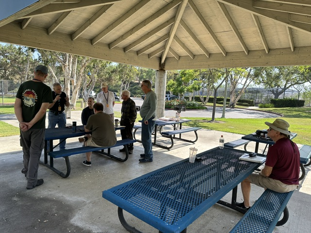
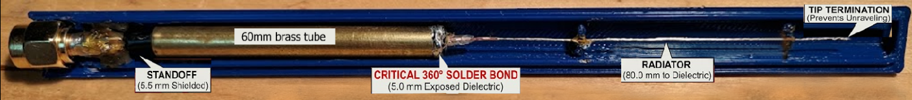
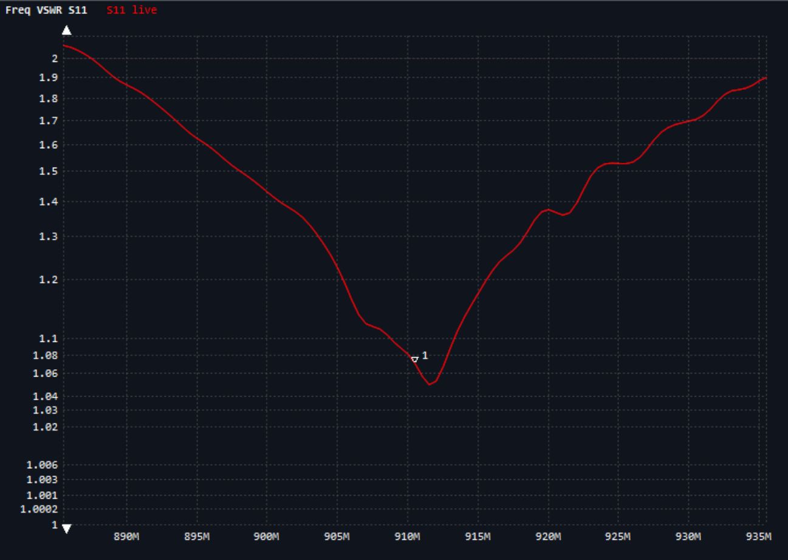
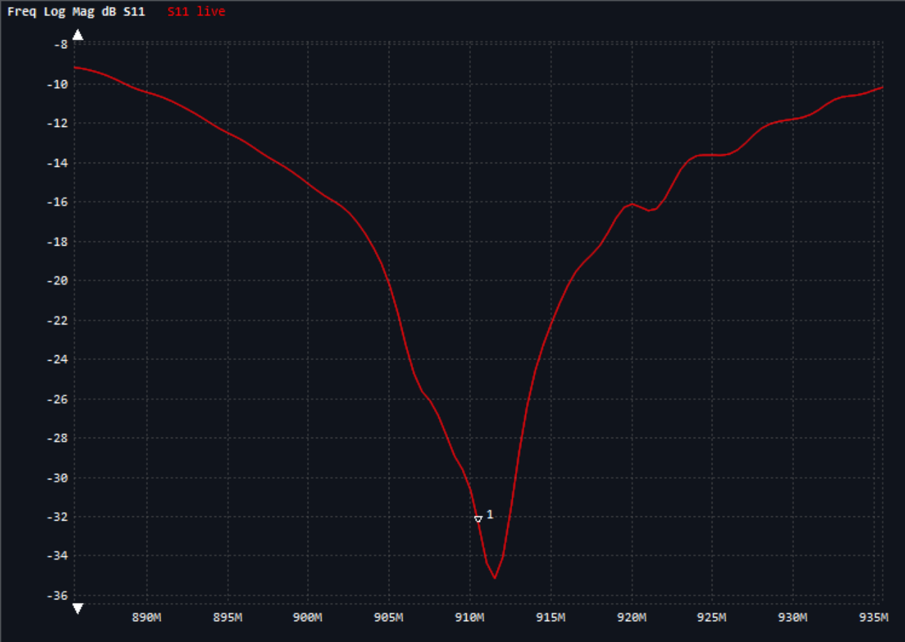
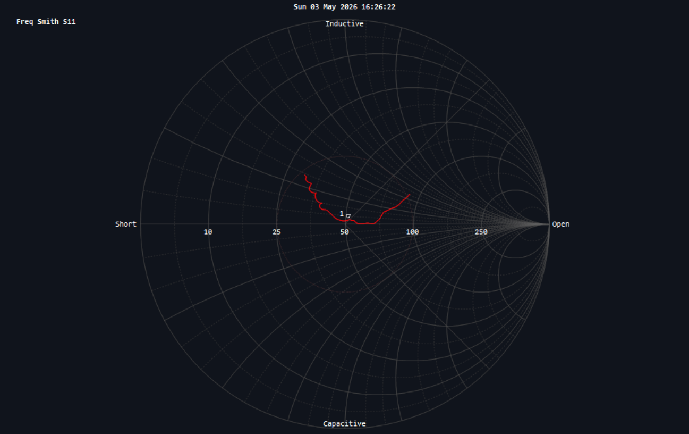
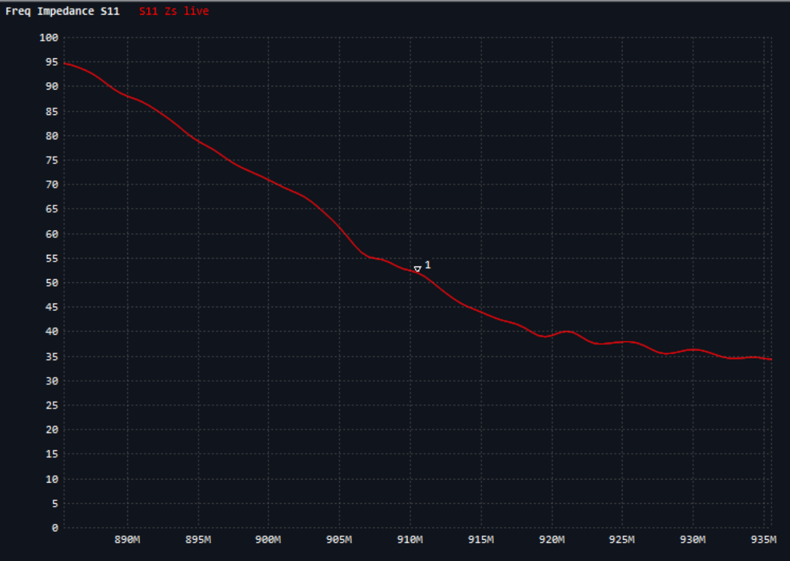
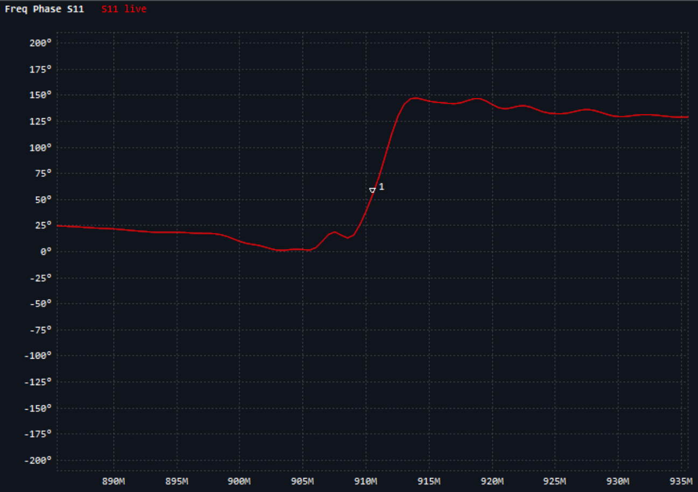
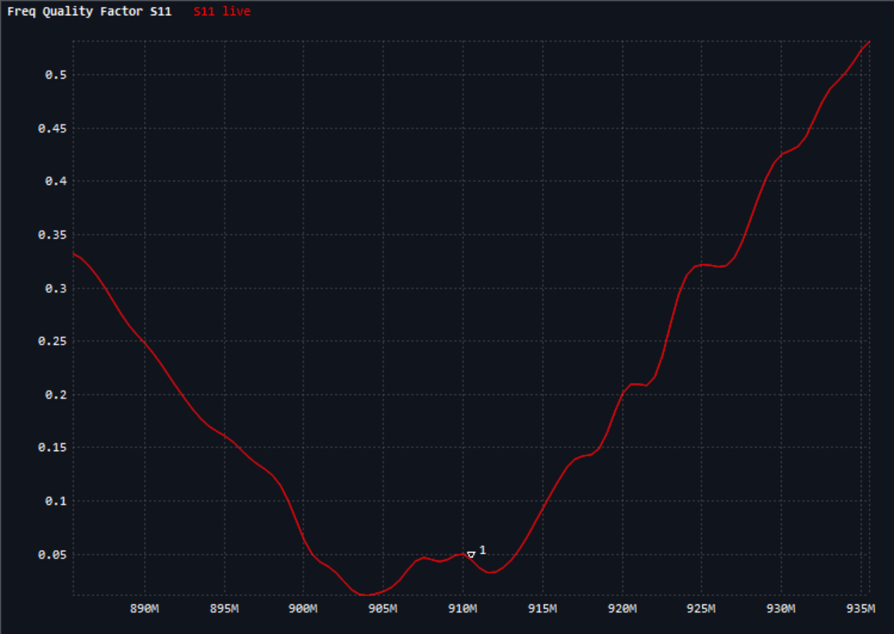

# The Propagator

**South Orange Amateur Radio Association | August 2026**

## Upcoming SOARA Events

### This Month — August 2026

| Date | Time | Event | Location |
|---|---|---|---|
| Saturday, August 15 | 9:00 AM–noon | SOARA Elmer Saturday | Gilleran Park |
| Monday, August 17 | 6:00 PM | Ham Radio License Exams | Murray Center |
| Monday, August 17 | 6:30 PM | Membership Meeting | Murray Center |
| Saturday, August 22 | 11:00 AM–3:00 PM | SOARA Annual Picnic | Laguna Niguel Regional Park |
| Monday, August 24 | 7:00 PM | Board Meeting | Murray Center |

### Next Month — September 2026

| Date | Time | Event | Location |
|---|---|---|---|
| Saturday, September 19 | 9:00 AM–noon | SOARA Elmer Saturday | Gilleran Park |
| Monday, September 21 | 6:00 PM | Ham Radio License Exams | Murray Center |
| Monday, September 21 | 6:30 PM | Membership Meeting | Murray Center |
| Monday, September 28 | 7:00 PM | Board Meeting | Murray Center |

*Dates, locations, and times are subject to change. Check the
[SOARA website](https://www.soara.org) before attending.*

## President's Message
It is getting warm in Southern California, as you know, but it is also the perfect
time to take your radio setup on the road while on vacation or maybe take a trip to
a local park and do some POTA (Parks on the Air). Even though we are having some
warm days, it is not as hot in Southern California as it is where I am now.

I am writing this from Defcon in Las Vegas. While Defcon is described as a "hacker
convention" it is really a mixture of a lot of different interests. Interest groups
are organized into "Villages." There is a Ham Radio Village, where they gave an
all-day training class to get people licensed as Technician class operators. They
also did license exams, with 132 new licenses and 32 upgrades. They also had fox
hunts and a number of presentations on lots of ham radio topics. Defcon is very
supportive of these villages and pay for exhibits, power, audio visual and the like.
I believe all of the talks will eventually be available on YouTube. This year is
Defcon 34, so you could search for them in a few days.

There are many other radio adjacent Villages. There is an RF Village, where people
use some very nifty SDRs (and some cheap ones, like RTL-SDR) to intercept transmissions
to decode them. Using GNU Radio and similar tools, they write custom demodulators to
try and extract the test messages being sent. There are a lot of interesting talks
on many aspects of using SDRs (software-defined radios) to decode and send using
protocols like LoRa, Bluetooth and Wi-Fi. They also setup decoders for key fobs,
remote control cars and other consumer devices. I am spending a lot of time learning
about new ways to use GNU Radio with an SDR transceiver to try and build a LoRa
Meshcore/Meshtastic router, for example.

One of the things I like about Defcon is that it allows me to sample and learn about
a very wide spectrum (no pun intended) of technologies, just like amateur radio. If
I want to learn more about 3D printing, there is a Village for that. If I want to
learn about lock picking, there is a Village for that. Just looking at a quick list,
there are at least 20 technical areas broken out that one can visit and learn from.
In fact, the only problem is that with about 750 scheduled talks for the three days,
it is like a firehose of information.

Amateur radio is the same way. I encourage you to get out of your comfort zone and
try something new with your radio equipment. Not only will you learn something new
that may expand your interest and increase your enjoyment of the hobby, it will give
you something to talk about and teach to others.

SOARA is having our traditional summer picnic on Saturday, August 22 at Laguna
Niguel Regional Park. We do not have an assigned area, because they are first come,
first served. A couple of us will be there when the park opens on Saturday and will
try to get the same area as in past years. Signs will be posted directing you, or
you can call on the Temple Hill 2M repeater when you get in the park for directions.

SOARA will be grilling hamburgers, hot dogs and will have buns and condiments. We
will also bring water and make lemonade. It would be nice if members who attend
bring a side dish or dessert. I hope you will join us at this fun event and, of
course, bring your family or significant other.

73,

Dale Tyler, W6EDT  
SOARA President

## SOARA Saturday Report
Thanks to everyone who came out to Gilleran Park: Ed, WA6ED; Dan, KO6BIX; Ray,
K6NOV; Jim, KI6LOM; Mike, KO6AOL; Claude, W6CAG; and Greg, N6PM.

Donuts were provided, paid for by donations. We have $2 left over for next month.

Ray, K6NOV, led a great discussion on CW, helping get folks organized so others can
start practicing together. We also covered a range of other topics during the
meeting.

*Members gather under the shelter at Gilleran Park for July's Elmer Saturday. Photo
by Ed Barnes, WA6ED.*

I've been cleaning out my shack and gave away some spare parts and radio gear —
expect more to give away in August.

Next meeting: Saturday, August 15, 2026, Gilleran Park, 9:00 AM–noon.

73,

Ed, WA6ED

## Membership Meeting

Our August meeting is **Monday, August 17, 2026** at the **Norman P. Murray Center**
in Mission Viejo. License exams start at 6:00 PM and the program begins at 6:30 PM,
as usual. This month's program topic will be announced.

## My Full Circle Story Adventures Thanks to Ham Radio

**By Tom B. Parkes, KI6DDB**

My ham radio odyssey has come full circle this 2026 Memorial Day. Ham radio
introduced me to some extraordinary and very special people like our missed SOARA
silent key Heiko, AD6OI. One of my earliest people helping, community service
adventures was Heiko's enlisting my help for water station 6 at mile 10.3 on the
Memorial Day Laguna Hills Half Marathon. After earning many Laguna Hills Half
Marathon t-shirts, COVID stopped this event for a while.

Many of my pre SOARA California Triple Crown long distance cycling events were
supported by ham radio nets because ham radio repeaters were the best way to cover
these 200 mile events. This is why I got my Tech ticket and then joined SOARA almost
20 years ago. My venerable Yaesu VX7R and I became roving course marshals on many Cal
Triple Crown cycling events.

Heiko also enlisted my ham radio support for the Orange County Marathon at the Irvine
Ave. and University Dr. mile 11 medical stop. My OC Marathon staff friend, Toby
Taylor, asked me to bike escort the lead male runner. My VX7R and I escorted the OC
Marathon for several years.

My VX7R bike escort ham radio introduced me to emergency communications through Costa
Mesa's MESAC and CERT (Community Emergency Response Team). As a full MESAC member,
I'm also able to help the Huntington Beach RACES (Radio Amateur Civil Emergency
Service) with their Surf City Marathon, 4th of July parade and the Pacific Air Show.
Thanks to MESAC I've helped the Costa Mesa Police finish four Baker to Vegas relay
race adventures. I remember SOARA members getting excited about helping Baker to
Vegas. Numerous other ham radio community service and people helping opportunities
opened up through MESAC.

I was "Shortcut Bike Mobile One" helping the Foothill Flyer Running club ham radio
folks support the Mount Disappointment ultra marathons for several pre-COVID years.

Eventually, the SoCalBikeEscorts took over OC Marathon bike runner escorting and I
became a SoCalBikeEscorts member. I'm both MESAC and SoCalBikeEscorts for the OC
Marathon. Adding the SoCalBikeEscorts link to my community service chain, enabled me
to support numerous non-ham radio running event adventures. Many of them are people
helping charity events.

My California Triple Crown cycling - SOARA - Heiko - LH Half Marathon - OC Marathon -
CM MESAC and CERT - Huntington Beach RACES - Foothill Flyer and SoCalBikeEscorts
community service chain has now come full circle. This most recent 2026 Memorial Day,
I once again enjoyed helping - as a non-ham radio SoCalBikeEscort - the 2026 Memorial
Day Laguna Hills Half Marathon Race with a heartfelt nod to SOARA and Heiko. I have
many new friends and a new Laguna Hills Half Marathon Race t-shirt to replace my
mostly worn out, retired pre-COVID LHHM t-shirts.

Ham radio opens up a cornucopia of extraordinary people and community service
adventures. Ham radio is a great way to thank all the people that helped all of us
along the way. Ham radio is definitely for community service and people oriented
adventurous spirits.

I hope SOARA members enjoy this, 73 and Cheers

Tom B. Parkes, KI6DDB

## Meshcore Coaxial Sleeve Dipole (910.525 MHz): Assembly & Technical Specification

**By Rich Gordon, W6BOT**

*Originally submitted as an 11-page technical specification dated May 3, 2026,
© 2026, all rights reserved. Transcribed here preserving the author's wording;
figures reproduced from the author's NanoVNA measurements and photos.*

This document defines the as-built mechanical and electrical parameters for the
high-stability coaxial sleeve dipole optimized for Meshcore nodes. The assembly
utilizes a 7/32" brass sleeve and RG-174 coaxial cable to achieve a precise
resonant match at the target frequency.

Note: AI was utilized to identify and verify dimensions, and velocity factor, for
this design.

### Antenna description

#### Theoretical basis

A sleeve dipole is a variation of the fundamental half-wave dipole. While a
theoretical isotropic radiator has a gain of 0 dBi, the half-wave dipole
concentrates energy perpendicular to the axis of the radiator, resulting in a
gain of 2.15 dBi (some loss is expected due to velocity factor and loss tangent
of the enclosure).

#### Factors affecting gain in this build

**Common mode suppression:** The 360° solder bond at the 65.5 mm mark ensures the
sleeve acts as a high-impedance balun. This prevents RF current from traveling
down the outside of the feedline, which would otherwise distort the radiation
pattern and reduce effective gain.

**Enclosure impact:** The 12 mm PETG hex enclosure introduces slight dielectric
losses. While PETG is relatively RF-transparent at 910.525 MHz, the proximity of
the material (dielectric loading) may slightly compress the radiation pattern,
potentially shifting the gain by +/-0.2–0.5 dB depending on the exact material
purity and wall thickness.

**Concentricity:** Using the RG-58U jacket segment as a spacer ensures the
radiator remains centered within the brass sleeve. Maintaining a constant
characteristic impedance of 50 ohms minimizes return loss, ensuring maximum
power transfer to the radiating elements.

#### Radiation pattern

The expected radiation pattern is toroidal (donut-shaped).

- **Maximum gain:** Perpendicular to the 150.5 mm vertical assembly (toward the
  horizon).
- **Null points:** Directly above the tip termination and directly below the SMA
  connector.

### Build parameters

- **Target frequency:** 910.525 MHz.
- **Transmission line:** RG-174 coaxial cable.
- **Sleeve material:** 7/32" x 0.014" wall brass tubing.
- **Environment:** 12 mm PETG hexagonal enclosure.
- **Centering mechanism:** 2–3 mm segment of RG-58U jacket (or similar) trimmed
  for concentric fit.

| Item | Component | Specification | Quantity |
|---|---|---|---|
| 1 | Coaxial Cable | RG-174 (12"/30 cm SMA jumper works well) | 1 |
| 2 | Sleeve Material | 7/32" x 0.014" wall brass tubing — K&S Precision Metals Round Brass Tube 8130 (7/32" OD x 0.014" wall x 12" long) | 60.0 mm |
| 3 | Connector | SMA crimp connector (not required if using an SMA jumper) | 1 |
| 4 | Centering Spacer | RG-58U jacket segment | 2 pcs, 2–3 mm |
| 5 | Enclosure | PETG 3D printed (polyethylene terephthalate glycol) | 1 set (2 halves) |
| 6 | Sealant | Neutral-cure silicone (e.g., Supreme Silicone M90006A) | As required |

### Dimension tables

All dimensions are measured starting from the 0.0 mm reference point at the top
of the SMA crimp ferrule.

#### Individual component dimensions (as tuned)

| Component | Dimension (L) | Description |
|---|---|---|
| Standoff Gap | 5.5 mm | Distance between SMA crimp and sleeve base. |
| Sleeve Length | 60.0 mm | Physical length of the 7/32" brass tube. |
| Feedpoint Gap | 5.0 mm | Exposed center dielectric between sleeve and whip. |
| Radiator Whip | 80.0 mm | Length of center conductor from top of dielectric. |

#### Cumulative (ordinate) dimensions

| Measurement Point | Ordinate (Z) | Feature Description |
|---|---|---|
| Reference 0 | 0.0 mm | Top of SMA crimp ferrule. |
| Point A | 5.5 mm | Bottom edge of brass sleeve. |
| Point B | 65.5 mm | Top edge of brass sleeve (360° solder point). |
| Point C | 70.5 mm | Top of exposed center dielectric. |
| Point D | 150.5 mm | Tip of radiating whip. |

*The assembled sleeve dipole, showing the 5.5 mm standoff, the 60 mm brass tube,
the critical 360° solder bond, the radiator, and the tip termination. Photo by
Rich Gordon, W6BOT.*

### Enclosure specification: 12 mm PETG hex

The antenna is housed in a custom 12 mm hexagonal PETG enclosure, providing
structural protection and environmental sealing.

- **Geometry:** The hexagonal profile increases mechanical rigidity and ensures
  stable positioning within the node chassis.
- **Dielectric loading:** The PETG material introduces parasitic capacitance,
  requiring the specific tuned lengths of 60.0 mm and 80.0 mm to maintain the
  910.525 MHz resonance.
- **Mechanical centering:** A 2–3 mm segment of RG-58U jacket is used as an
  internal spacer. This provides a precise friction fit between the RG-174 cable
  and the 4.85 mm ID of the 7/32" brass tube, ensuring strictly concentric
  geometry.

#### Critical assembly requirements

- **360° solder bond:** The RG-174 shield must be fully bonded to the
  circumference of the brass sleeve at the 65.5 mm mark to establish the RF
  return path. Use care to not melt the center dielectric.
- **Concentricity (zero-heuristic rule):** The RG-58U jacket spacer must be
  positioned to prevent the radiator from deviating from the center axis,
  maintaining impedance stability.
- **Dimensional sanity check:** Total dimension = 5.5 (standoff) + 60.0 (sleeve) +
  5.0 (dielectric) + 80.0 (whip) = 150.5 mm.

#### Mechanical specification: 12 mm PETG hexagonal enclosure

The radome for the 910.525 MHz coaxial sleeve dipole is a custom-engineered
hexagonal housing. It serves as both a structural chassis and a dielectric
component of the antenna system.

**Material requirements**

- **Polymer:** PETG (polyethylene terephthalate glycol-modified).
- 3 horizontal and 3 vertical perimeters.
- **Infill:** 100% (solid wall). Air gaps within the enclosure wall will cause
  inconsistent dielectric loading and shift the resonant frequency.
- **Wall thickness:** Optimized for the calibrated velocity factor (Vf) of the
  60.0 mm sleeve and 80.0 mm radiator.

**Geometric specifications**

The enclosure (radome) consists of two identical halves, which snap together.

- **Profile:** Hexagonal (6-sided).
- **Width (flat-to-flat):** 12.0 mm.
- **Internal channel:** 5.80 mm to 6.00 mm diameter. This provides a clearance
  fit for the 7/32" (5.56 mm) brass sleeve.
- **Internal alignment:** The channel must be perfectly centered to maintain the
  Item #3 (concentric geometry) requirement. Off-center placement will result in
  an asymmetrical radiation pattern.

**Dielectric considerations**

- **Dielectric constant:** approximately 2.4–3.0.
- **Velocity factor shift:** The proximity of the PETG walls effectively
  "shortens" the wavelength. The build dimensions of 150.5 mm (total extension)
  are specifically tuned to compensate for this shift.
- **RF transparency:** PETG is selected for its low loss tangent at sub-GHz
  frequencies, ensuring minimal signal attenuation for Meshcore nodes.

*3D model of the two-piece hexagonal PETG enclosure. Image by Rich Gordon,
W6BOT.*

#### Integration and sealing

- **SMA interface:** The base of the enclosure must securely capture the SMA
  connector body to prevent rotational stress on the 5.5 mm standoff gap.
- Should this antenna be intended for outdoor use, a moisture barrier is
  advisable. Once the antenna is tuned and verified, the entry and exit points of
  the enclosure should be sealed with a neutral-cure silicone (e.g., Supreme
  Silicone M90006A) to prevent internal oxidation of the brass sleeve and copper
  radiator.
- **Mounting:** The hexagonal flat faces allow for secure zip-tie or bracket
  mounting to node enclosures without the slippage common to circular radomes.
- To complete the enclosure for final assembly and make a robust connection at
  this high-stress point, a hex bushing designed to tightly fit over the SMA end
  of the enclosure. Use a heat gun or other appropriate source to warm the
  bushing to soften the material prior to forcing the enclosure into the bushing.
  Alternately, tape, wire tie or similar may be used.

#### Final assembly verification

The antenna must be fully inserted into the enclosure before final VNA
verification.

- **Sanity check:** Ensure the 80.0 mm radiator is not bent or compressed against
  the end-cap of the enclosure, as this will introduce significant inductive
  loading.

*The finished antenna mounted on a Meshcore node. Photo by Rich Gordon, W6BOT.*

### Tuning and calibration protocol

The following procedures define the deterministic tuning steps for verifying the
resonance of the as-built antenna within the 12 mm PETG hex enclosure.

#### Pre-assembly resonance check

Before final sealing in the PETG housing, perform an initial VNA (Vector Network
Analyzer) sweep to establish a baseline.

- **Target center frequency:** 910.525 MHz.
- **Measurement reference:** Connect the SMA interface directly to a calibrated
  VNA.
- **Initial SWR target:** < 1.5:1 in free air. Note that the frequency will shift
  downward once inserted into the PETG housing due to dielectric loading.

#### Physical tuning adjustments

If the resonant frequency deviates from 910.525 MHz, adjust the 80.0 mm radiator
whip (Point C to Point D).

- **Frequency too low:** Trim the radiator tip in 0.5 mm increments. Apply a
  minimal amount of solder to the tip after each cut to prevent the RG-174
  strands from unraveling.
- **Frequency too high:** Verify the 360° solder bond at the top of the sleeve
  (Point B). A cold joint or incomplete bond at the 65.5 mm mark will cause
  erratic resonance shifts.
- **Impedance matching:** Ensure the RG-58U jacket spacer is maintaining
  concentricity between the RG-174 and the 7/32" brass tube. Non-concentric
  geometry shifts the characteristic impedance away from 50 ohms.

As you can see by the graphs, while the 2:1 bandwidth is fairly wide, there is a
significant advantage in tuning to your desired frequency. Note however that the
wavelength at this frequency is approximately 330 mm / 12.96". When tuning, it is
critical that you make your trim based on readings with the enclosure installed.

| Threshold | Low Frequency (fL) | High Frequency (fH) | Total Bandwidth (Δf) |
|---|---|---|---|
| 2.0:1 | ~ 887.0 MHz | > 935.0 MHz | > 48.0 MHz |
| 1.5:1 | ~ 898.5 MHz | ~ 922.5 MHz | 24.0 MHz |

#### Enclosure calibration

The 12 mm PETG hex enclosure acts as a radome and alters the electrical length of
the antenna.

- **Dielectric offset:** Final tuning must be performed with the antenna fully
  seated in the enclosure.
- **Final verification:** The as-built total extension of 150.5 mm (from SMA crimp
  to radiator tip) is specifically calibrated for the velocity factor shift
  introduced by this housing.

#### Summary of tapping/ordinate points for VNA reference (910.525 MHz)

| Measurement Goal | Component to Inspect | Ordinate (Z) Target |
|---|---|---|
| Coarse Tuning | Radiator Whip Length | 80.0 mm |
| Return Loss/SWR | 360° Solder Joint | 65.5 mm |
| Stability/Noise | Standoff Gap | 5.5 mm |
| Resonance Center | Total Extension | 150.5 mm |

#### Alternate Meshcore frequencies utilized in the US

| Frequency (MHz) | Standoff Gap | Sleeve Length | Feedpoint Gap | Radiator Whip | Total Length |
|---|---|---|---|---|---|
| 909.875 (Sacramento) | 5.50 | 60.04 | 5.00 | 80.06 | 150.60 |
| 910.525 (Reference) | 5.50 | 60.00 | 5.00 | 80.00 | 150.50 |
| 915.000 (High Speed) | 5.47 | 59.71 | 4.98 | 79.61 | 149.77 |
| 927.875 (SoCal) | 5.40 | 58.88 | 4.91 | 78.50 | 147.69 |

As you can see from the table, the minor adjustments for these frequencies are
beyond what would be practical for "cut to length," and due to variations in
materials each antenna needs to be fine tuned with a VNA for the actual
frequency.

Dimensions for other frequencies may be calculated by: L_NEW = L_REF × (f_REF /
f_NEW).

### Other notes and comments

My decision to build this antenna stems from the poor performance of the 40 mm
stub antennas which come packaged with the Meshcore "Starter" kits, and the fake
claims of high gain whips typically available from Amazon and AliExpress.

Keep in mind that a 1/2 wave dipole has a gain of 2.15 dBi (gain over an isotropic
radiator) due to the radiation being shaped into a "donut."

| Antenna Type | Typical Marketed Gain | Actual Realized Gain | Inflation Delta (Δ) | Technical Cause of Delta |
|---|---|---|---|---|
| 40 mm Kit Stub | 2.5 dBi | -1.5 dBi | 4.0 dB | High ohmic loss in loading coil; aperture too small. |
| 82 mm 1/4λ Whip | 3.0 dBi | 0.5 – 1.0 dBi | 2.0 dB | Missing ground plane / counterpoise in field use. |
| 1/2λ Sleeve Dipole (this build) | 1.9 dBi | 1.9 dBi | 0.0 dB | Verified via NanoVNA; ground-independent. |
| 190 mm Whip | 10 dBi | 1.5 – 2.5 dBi | 4.85 – 7.85 dB | Mathematically impossible. |
| 18" Collinear | 8.0 – 10.0 dBi | 5.5 – 6.5 dBi | 2.5 – 3.5 dB | Phasing coil losses; pattern "lobing" (energy tilt). |
| 600 mm Yagi | 18.0 dBi | 9.0 – 11.0 dBi | 7.0 – 9.0 dB | Physical size restricts element count (aperture limit). |

#### The "cable loss" oversight

A common fallacy across all antenna types is ignoring the feed line. RG-58 or
RG-174 coax has high attenuation at 910 MHz.

- **RG-174 loss:** Approximately 1.0 dB per meter (0.3 dB/ft).
- **The result:** If you use a "high-gain" 6 dBi antenna but connect it with 3.0
  meters (9.8 ft) of RG-174, you have lost 3.0 dB in the cable. Your net system
  gain is now 3.0 dBi, roughly the same as mounting this sleeve dipole directly to
  the node with no cable.

If you would like to build this antenna I can provide the STL files for the
enclosure. Please send any comments, questions or requests for the enclosure STL
files to wsixbot@gmail.com.

73,
Rich Gordon, W6BOT

### Measurement plots (NanoVNA)

The author supplied the following NanoVNA measurements of the as-built antenna.

*Measured VSWR sweep. The SWR minimum sits near the target frequency with a wide
2:1 bandwidth. NanoVNA plot by Rich Gordon, W6BOT.*

*S11 return loss, log magnitude. NanoVNA plot by Rich Gordon, W6BOT.*

*Smith chart showing the impedance locus through resonance. NanoVNA plot by Rich
Gordon, W6BOT.*

*Impedance versus frequency. NanoVNA plot by Rich Gordon, W6BOT.*

*Phase versus frequency. NanoVNA plot by Rich Gordon, W6BOT.*

*Quality factor (Q) across the sweep. NanoVNA plot by Rich Gordon, W6BOT.*

## Treasurer's Report
**Reporting period:** October 1, 2025 through July 31, 2026 (ten months)  
**Prepared by:** Ron Mosher, K0PGE, SOARA Treasurer

| Ten Months | July 2026 | July 2025 | Increase/(Decrease) |
|---|---:|---:|---:|
| **Cash Income:** | | | |
| Memberships | $8,315.00 | $9,781.00 | $(1,466.00) |
| Other & Interest | $2,370.49 | $3,848.00 | $(1,477.51) |
| **Total Cash Income** | **$10,685.49** | **$13,629.00** | **$(2,943.51)** |
| **Cash Expenses:** | | | |
| Repeaters incl. site rental, utilities & insurance | $6,158.83 | $6,141.00 | $17.83 |
| Member Activities | $2,995.71 | $2,966.00 | $29.71 |
| Other expenses | $2,822.58 | $1,217.00 | $1,605.58 |
| **Total Cash Expenses** | **$11,977.12** | **$10,324.00** | **$1,653.12** |
| **Cash Net Income** | **$(1,291.63)** | **$3,305.00** | **$(4,596.63)** |
| Beginning Cash — October 1 | $28,179.03 | $25,745.00 | $2,434.03 |
| Ending Cash — July 31 | $26,887.40 | $29,050.00 | $(2,162.60)|

*If any member has questions about the financials, please contact the Treasurer or
any Board member.*

## SOARA Information

**Meetings:** SOARA meets at the Norman P. Murray Center, 24932 Veterans Way,
Mission Viejo, CA on the third Monday of every month at 7:00 PM. For January and
February, the third Monday is a holiday and the meeting is held on the fourth
Monday.

**License Exams:** Amateur license exams are given prior to SOARA meetings, except
June. Exams are at 6:00 PM. Prior registration is not required and walk-in
applicants are welcome. For June, exams are held at Field Day. For further
information, email Steve Kuver, K6UVR, at k6uvr@soara.org.

**SOARA Library:** SOARA has many amateur radio related books such as handbooks,
books about electrical theory, and more available to lend to club members. Contact
library@soara.org for more information.

**Web Site:** SOARA maintains a web site with current club information at soara.org.

### Repeaters

The Laguna Beach, San Clemente, and Trabuco repeaters are open. The Santiago Peak
repeaters are closed. For details or questions on the repeaters, contact the
repeater director at repeater@soara.org.

| Band | Frequency | Shift | Tone / Notes | Location |
|---|---|---|---|---|
| 2m | 147.645 | − | (110.9) | Laguna Beach |
| 2m | 146.025 | + | (110.9) | San Clemente |
| 2m | 145.240 | − | (110.9) | Trabuco |
| D-STAR 2m | 146.115 | + | (K6SOA C) | Laguna Beach |
| 220 | 224.100 | − | (110.9) | Laguna Beach |
| 220 | 224.640 | − | (pvt) | Santiago Peak (C) |
| 440 | 445.660 | − | (110.9) | Laguna Beach |
| D-STAR 440 | 445.705 | − | (K6SOA B) | Laguna Beach |
| 440 | 447.180 | − | (pvt) | Santiago Peak (C) |
| D-STAR 1.2G | 1282.600 | − | (K6SOA A) | Laguna Beach |

### Nets

- 40 meter HF (7.200 MHz +/−): Sundays at 8:00 AM
- 10 meter HF (Technicians welcome) (28.415 +/−): Sundays at 9:00 AM
- General Membership Net — UHF/VHF (447.180, 147.645 & 224.640): Tuesdays at 8:00 PM
- D-STAR (146.115 C module): Wednesdays at 8:00 PM
- Tech Net — 147.645, 224.640, 447.180: Saturdays at 9:00 AM
- California Rescue Communications (Gordo Net) HF (7.250 MHz +/− for QRM): Weekdays at 8:30 AM
- MVRACES — 447.180: Tuesdays at 7:00 PM
- Tri-Cities RACES — 146.025: Wednesdays at 8:00 PM
- LNACS — 147.645: Thursdays at 7:00 PM
- OC Parks Fire Watch — 447.180: Thursdays at 8:00 PM

### SOARA Officers

- **President:** Dale Tyler, W6EDT — w6edt@soara.org — 949-360-1717
- **Vice President:** Greg Unruh, WE4BY — we4by@soara.org
- **Secretary:** Charles Schultz, NY6I — ny6i@soara.org
- **Treasurer:** Ron Mosher, K0PGE — k0pge@soara.org — 949-363-0047

### SOARA Directors

- **Repeater:** Open
- **Publications:** Ray Frericks, K6NOV — k6nov@soara.org
- **Membership:** Open
- **Education:** Steve Kuver, K6UVR — k6uvr@soara.org — 949-874-1972
- **Technical:** Tom Hobbs, AE6SH — ae6sh@soara.org — 949-887-6527
- **Communications:** Ray Hutchinson, AE6H — ae6h@soara.org

### SOARA Appointments

- **Past President:** Ray Hutchinson, AE6H — ae6h@soara.org
- **Activities Coordinator:** Open
- **SOARA Saturdays:** Ed Barnes, WA6ED — wa6ed@soara.org — 949-468-7706
- **Raffle:** Open
- **Testing:** Steve Kuver, K6UVR — k6uvr@soara.org
- **Website:** Open

### Contacting SOARA

Website: soara.org &nbsp;|&nbsp; Membership: membership@soara.org &nbsp;|&nbsp;
Postal: P.O. Box 2545, Mission Viejo, CA 92690 &nbsp;|&nbsp; Facebook: K6SOA
&nbsp;|&nbsp; Twitter/X: @K6SOA

*Dates, locations, times, and frequencies are subject to change. Check the SOARA
website before attending an event.*
