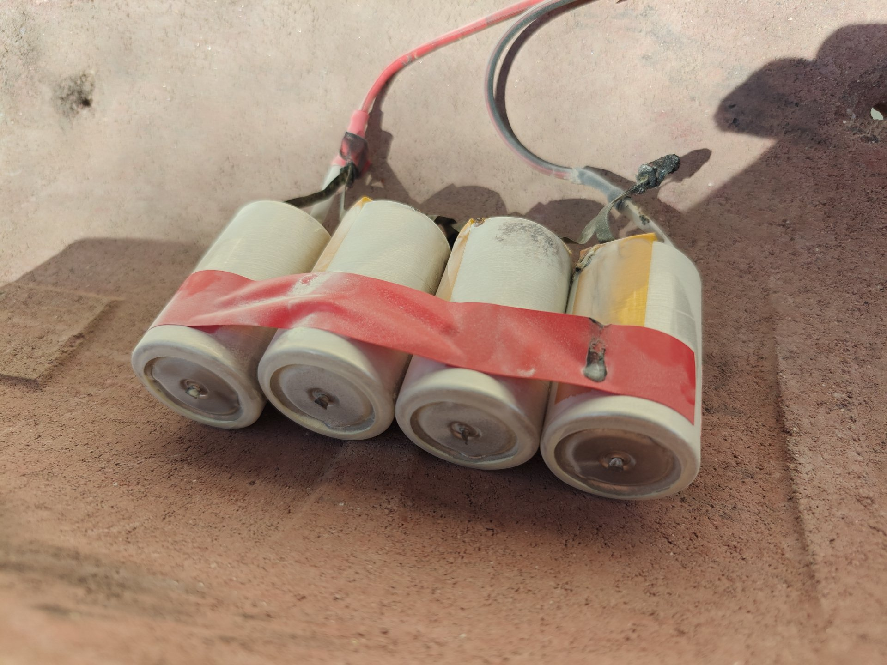
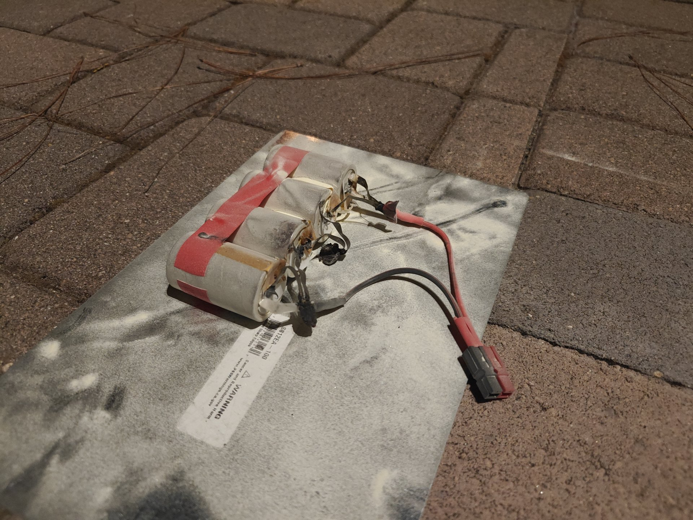
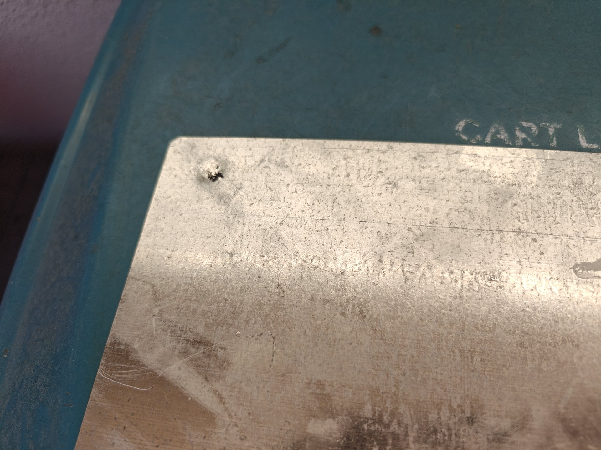

# Battery Fire Follow-Up: What Went Wrong

During a recent Tuesday night VHF/UHF net, Mike Mahan, K6MSM, had to break off
his transmission when a battery pack he was using caught fire — the incident
Dale, W6EDT, mentioned in his President's Message elsewhere in this issue as a
reminder to have a plan ready if a battery pack or its wiring catches fire.
Mike followed up with the Board afterward with a closer look at what actually
went wrong, in his own words, along with photos of the aftermath.

I placed four of these batteries in series to get a nice 12 volts. Everything
was fine until I put the pack on a metal plate after cleaning out the ammo box
that had held it overnight.

I believe my mistake was not realizing that the bottom of these batteries is
the negative terminal as well. Doing this with one battery isn't an issue, but
when the batteries are in series and I shorted the negative terminal of a
battery down the line to the metal plate, the "magic" started. Since the
batteries are in series, the negative terminal down the line wasn't at zero —
so there was a voltage difference between the negative terminals. I think this
ended up causing a short through the negative terminals rather than the
positive ones. If I'd placed the pack flat instead of resting the negative
terminals on the metal plate, I suspect this wouldn't have happened. What does
everyone think?

*Bottom view of the four-cell pack. Each cell's case bottom is also its
negative terminal — resting them on the metal plate is what created the short.
Photo by Mike Mahan, K6MSM.*

Next time I run these in series — and some of these batteries might still be
okay, I'll find out shortly — I'll make sure to tape the bottoms of the
negatives so I don't get an unintentional short again.

I must have had the presence of mind to knock the pack onto its side to remove
the short, which at least stopped the source of the fire.

*Melted wiring and connectors at one end of the pack, on the scorched metal
plate. Photo by Mike Mahan, K6MSM.*

*A burned-through hole in a nearby plastic lid gives a sense of how much heat
the short generated. Photo by Mike Mahan, K6MSM.*

Mike, K6MSM

## Assets

| File | Subject | Caption | Photo credit |
|---|---|---|---|
| `assets/feature-battery-fire-negative-terminals-k6msm-01.jpeg` | Bottom view of 4-cell pack, exposed negative terminals | "Bottom view of the four-cell pack..." | Mike Mahan, K6MSM (to confirm) |
| `assets/feature-battery-fire-damage-k6msm-02.jpeg` | Close-up of melted wiring/connectors on the scorched plate | "Melted wiring and connectors..." | Mike Mahan, K6MSM (to confirm) |
| `assets/feature-battery-fire-melted-hole-k6msm-03.jpeg` | Burned-through hole in a plastic lid | "A burned-through hole..." | Mike Mahan, K6MSM (to confirm) |

Five more raw photos from Mike's email are sitting in
`assets/_review2/` (unused): two more angles of the pack, a burned hole in
what looks like a trash/recycling cart lid, an undamaged single cell, and a
workbench shot with a D-cell datasheet. None seemed to add much beyond the
three used above — swap any of these in if you'd rather use different shots.

## Editor Notes

### Intro paragraph — written by the editor, not Mike

Per Ray's request, the opening paragraph connecting this to Dale's mention on
the net and in his President's Message was written by the editor (not part of
Mike's email) — everything from "I placed four of these batteries..." onward is
Mike's own account.

### Mechanical fixes made

- Mike's email was one long, informally-punctuated block (sent from a phone);
  broken into paragraphs for readability per `docs/generation-guide.md`'s
  allowance for organizing raw/informal material into readable prose "without
  dropping any of the substance." No sentences, reasoning, or conclusions were
  cut — including "What does everyone think?", which I left in even though it
  was originally addressed to the Board rather than the general membership, per
  `CLAUDE.md`'s full-preservation rule.
- Light copyediting only: comma/period cleanup, "12 volts right?" → "12 volts."
  (dropped only because it was a rhetorical aside to the Board, not a factual
  claim), "he" → no changes to any technical claims or his stated conclusions.
- "Get Outlook for Android" mobile signature and forwarding footer removed as
  email boilerplate, not submitted content.
- Callsign confirmed from the email header: K6MSM.

### To verify

- **Permission to publish — RESOLVED 2026-09-15.** Mike approved the article
  for publication. His one correction: "I place" → "I placed" (applied in this
  file and in `newsletter.md`).
- **Mike Mahan, K6MSM** — first appearance in the newsletter this year; not
  independently confirmed as a current member (no reason to doubt it, just
  noting it wasn't cross-checked against a roster).
- **Technical explanation.** Mike's theory about the short forming through the
  negative terminals due to a voltage difference down the series string is his
  own account of what happened, not independently verified — presented as his
  analysis, which is appropriate for a first-person account.
- **Placement.** Put this in Member Feature since it's a substantive first-
  person technical account, following the established pattern for that
  section. Move it if you'd rather it run closer to the President's Message
  itself, since it directly follows up on that.
