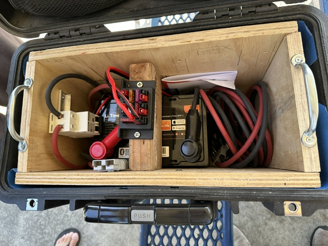
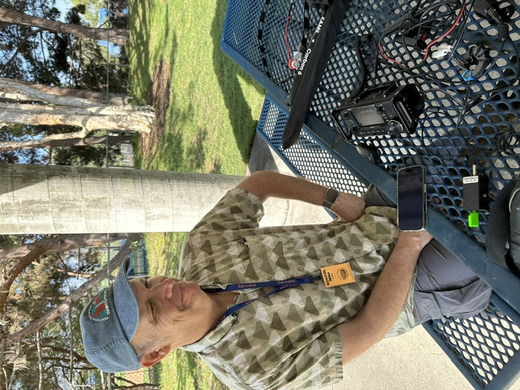
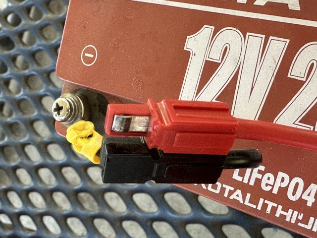
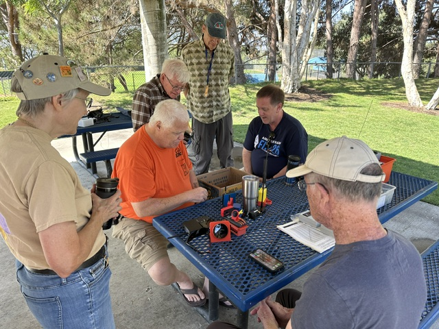

# SOARA Saturday Report — August 15, 2026

The last SOARA Saturday was August 15, 2026, at Gilleran Park. The theme was
battery boxes and connector boxes. Greg, N6PM, brought donuts. We broke even
on donut cost — zero donut fund balance for September. The sign-in sheet
could not be found, so there's no attendee list this time.

Stan, KM6VNI, demoed this huge battery box on a cart. Wow, Stan!

*Inside Stan, KM6VNI's battery box. Photo by Ed Barnes, WA6ED.*

Mike, KO6AOL, brought his HF rig setup for CW.

*Mike, KO6AOL, with his HF rig setup for CW. Photo by Ed Barnes, WA6ED.*

Greg, WE4BY, had a broken PowerPole on his battery — but it still works!

*Close-up of the PowerPole connector on Greg, WE4BY's battery. Photo by Ed
Barnes, WA6ED.*

Brian, NJ6N, brought some interesting projects — one tracked aircraft on a
little round display, and another was a PowerPole expander. It was a fun
morning.

*Members gather around a picnic table at Gilleran Park. Photo by Ed Barnes,
WA6ED.*

## Next SOARA Saturday

- Date: Saturday, September 19, 2026
- Time: 9:00 AM-noon
- Location: Gilleran Park
- Theme: Digital modes (FreeDV and JS8Call workshop on HF planned; other
  digital and UHF/VHF modes welcome too)
- Donuts will be provided.

See the full announcement in this issue's Club News and Opportunities section
for details and links.

73,

Ed, WA6ED

## Assets

| File | Subject | Caption | Photo credit |
|---|---|---|---|
| `assets/soara-saturday-group-wa6ed-01.jpeg` | Five or six members standing/seated around a picnic table with gear | "Members gather around a picnic table at Gilleran Park." | Ed Barnes, WA6ED |
| `assets/soara-saturday-portrait-unconfirmed-wa6ed-02.jpeg` | A bearded man in a cap with an "FEW" patch, holding a phone | Not used — subject not identified in Ed's email | Ed Barnes, WA6ED |
| `assets/soara-saturday-battery-box-wa6ed-03.jpeg` | Open wooden/case battery box with wiring and PowerPole connectors | "Inside Stan, KM6VNI's battery box." | Ed Barnes, WA6ED |
| `assets/soara-saturday-hf-rig-ko6aol-wa6ed-04.jpeg` | Man in blue cap with lanyard reading "Michael," seated at a table with radio gear | "Mike, KO6AOL, with his HF rig setup for CW." | Ed Barnes, WA6ED |
| `assets/soara-saturday-powerpole-wa6ed-05.jpeg` | Close-up of red/black PowerPole connectors on a LiFePO4 battery | "Close-up of the PowerPole connector on Greg, WE4BY's battery." | Ed Barnes, WA6ED |

## Editor Notes

### Mechanical fixes made

- Callsign punctuation set to the club's house style used in prior issues
  ("Stan, KM6VNI" rather than "Stan KM6VNI").
- "9am to noon" → "9:00 AM-noon" per `docs/editorial-style.md`.
- Reordered slightly: Ed's email opened with the forward-looking "next SOARA
  Saturday" paragraph before the report on the August 15 event itself; moved
  that paragraph to a "Next SOARA Saturday" section at the end, matching the
  template and last issue's structure. No wording was changed, only position.
  Confirm this reordering is acceptable — it wasn't asked for, just inferred
  from the template.
- Groups.io/email boilerplate ("Sent from my iPad. Please disregard typos.")
  removed as list footer, not submitted content.

### Theme correction (2026-09-13)

Ed's September 5 email (this file's source) named the September 19 theme as "Satellites," with Ed unsure whether there'd be satellite demos. A follow-up email from Ed on September 12 (`submissions/_inbox/[soara-members] Next SOARA Elmer Saturday is 9_19 Gilleran park, RF digital modes.eml`, normalized to `submissions/club-news-soara-saturday-digital-modes-wa6ed.md`) sets the theme as digital modes instead. The "Next SOARA Saturday" section above has been updated to the newer theme. Worth confirming with Ed that satellites isn't also still happening alongside digital modes.

### Photo-to-caption pairing — confirmed by Ray, 2026-09-13

Ed's email interleaved five photos with caption text without making it
unambiguous which photo goes with which sentence. I matched four of them by
visual content (battery box → Stan, KM6VNI; HF rig → Mike, KO6AOL; PowerPole
close-up → Greg, WE4BY; group shot used generically) and Ray reviewed the
rendered draft PDF and confirmed the pairings are correct. The fifth photo
(portrait of a bearded man in an "FEW" cap) remains unidentified and unused —
no one has named him.

### Photo credit — confirmed by Ray, 2026-09-14

All five images arrived inline in Ed's email with no explicit photographer
credit, so it was carried as "Ed Barnes, WA6ED (to confirm)" pending
confirmation. Ray has confirmed Ed, WA6ED, as the photographer for all five;
the "(to confirm)" flag has been removed from the captions above, the Assets
table, and `newsletter.md`.

### To verify

- **Attendee count / sign-in sheet.** No attendee list this time; Ed couldn't
  find the sign-in sheet. Left exactly as submitted — no names added beyond
  who Ed mentioned by name in the body.
- **Donut fund.** "Zero donut fund balance for September" follows last issue's
  "$2 left over for next month" — consistent, no gap to flag this time.
- **Event date.** Subject line says "August SOARA Elmer Saturday Report" and
  the body confirms "8/15/2026," which is the third Saturday of August and
  matches the front-page calendar in the August issue. Email itself was sent
  September 5, 2026.
